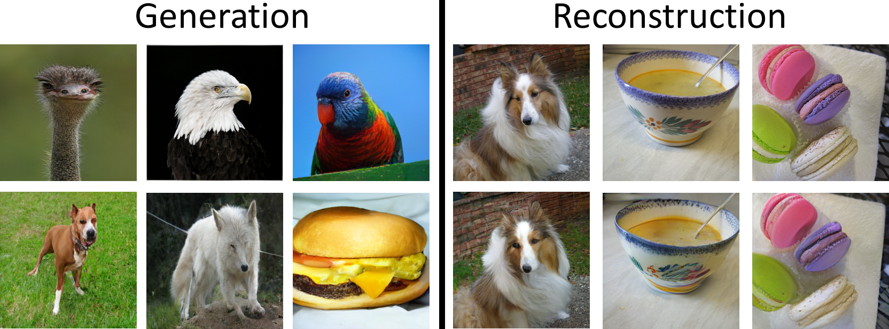

# maskgit-torch

This is an unofficial conversion of the [original Maskgit in JAX](https://github.com/google-research/maskgit) into PyTorch.

It is more-or-less a stripped down translation of the original model to work in PyTorch.
It only supports inference (no training), and it contains ports of both the source code and the official weights.

## Requirements

It is recommended to use [Anaconda](https://www.anaconda.com/products/distribution) to create a virtual environment to run this code.

### Creating a conda environment

If you have Anaconda installed, use a terminal to run:
```bash
conda env create -f environment.yml
```

Then activate the newly created environment:
```bash
conda activate mgtorch
```

### Without conda

If you do not want to use Anaconda, then check the file [environment.yml](environment.yml) to see the list of requirements and manually install them.

## Pretrained weights

These weights are direct conversions to PyTorch of the officially release JAX weights.

If you want to see how they were converted, please check the conversion notebooks:

- [convert_tokenizer_weights.ipynb](convert_tokenizer_weights.ipynb)
- [convert_transformer_weights.ipynb](convert_transformer_weights.ipynb)

The table below show some results on ImageNet when using the converted weights:

Resolution | Model       | FID  | Link
-----------|-------------|------|-----
256        | tokenizer   | 2.26 | [checkpoint](https://github.com/hmorimitsu/maskgit-torch/releases/download/weights/tokenizer_imagenet256.ckpt)
512        | tokenizer   | 1.24 | [checkpoint](https://github.com/hmorimitsu/maskgit-torch/releases/download/weights/tokenizer_imagenet512.ckpt)
256        | transformer | 6.10 | [checkpoint](https://github.com/hmorimitsu/maskgit-torch/releases/download/weights/maskgit_imagenet256.ckpt)
512        | transformer | 7.04 | [checkpoint](https://github.com/hmorimitsu/maskgit-torch/releases/download/weights/maskgit_imagenet512.ckpt)

Notes:

- The FID was calculated using the [clean-fid](https://github.com/GaParmar/clean-fid) package.
- The tokenizer was tested by reconstructing the 50000 images from the ImageNet validation set. For the reconstruction, the images were resized (using bicubic interpolation) so that the smallest side has the target resolution (e.g. 256), then they were center cropped to the target size.
- The transformer was tested by generating 50 samples of each of the 1000 ImageNet classes and computing the FID with the validation set.

### Downloading the weights

Just run:
```bash
python download_weights.py
```

to download all the weights into the correct folder.

If you prefer to manually download them, create a folder called `checkpoints`, download the desired weights using the links above and save them
inside the `checkpoints` folder (do not change the checkpoint names).

## Usage

Two scripts are provided, for image reconstruction and generation.
To use them, first download the respective pretrained weights listed above.
Both scripts have an `--output_dir` argument that indicates where the outputs will be saved.

### Reconstruction

To use the tokenizer to reconstruct some images from a directory, run:

```python
python reconstruct_images.py --images_dir /path/to/images/directory --image_size 256
```

### ImageNet conditional generation

To use the transformer to generate 5 random images from ImageNet classes `90`, `180`, and `270`, run:

```python
python generate_imagenet.py --image_size 256 --samples_per_class 5 --classes 90,180,270
```

If you want to generate samples from all classes, then just omit the `--classes` argument.

## Example results



## Citation

If you use this code, please remember to cite the official paper:

```
@InProceedings{chang2022maskgit,
  title = {MaskGIT: Masked Generative Image Transformer},
  author={Huiwen Chang and Han Zhang and Lu Jiang and Ce Liu and William T. Freeman},
  booktitle = {The IEEE Conference on Computer Vision and Pattern Recognition (CVPR)},
  month = {June},
  year = {2022}
}
```

## License

The source code is licensed under the Apache 2.0 license.

The weights are just direct conversions of the [official ones](https://github.com/google-research/maskgit), so you must adhere to the official license to use them.

## Acknowledgements

- Most of the code is a direct translation of the [official Maskgit in JAX](https://github.com/google-research/maskgit). I thank the authors for releasing the code for us!
- The bidirectional transformer code comes from the [MaskGIT-pytorch](https://github.com/dome272/MaskGIT-pytorch) repo. If you need a more complete code which includes the training stage, be sure to check this repo.
